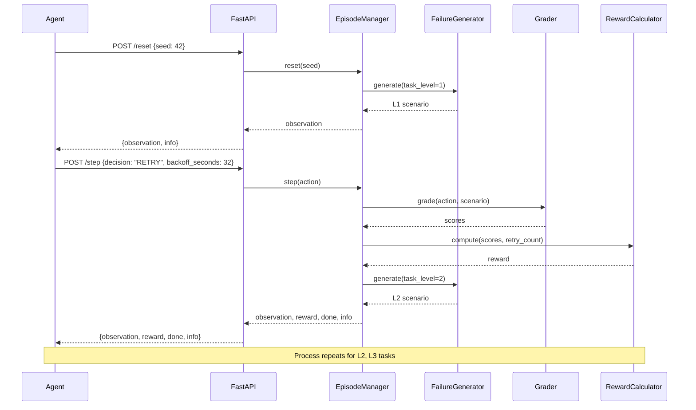

# AgenticDLQ Triage

An OpenEnv environment for training reinforcement learning agents to diagnose and recover from production tool-call failures.

## Architecture

```mermaid
graph TB
    subgraph "Client Layer"
        A[Agent/Client] --> B[HTTP Requests]
    end
    
    subgraph "FastAPI Server"
        B --> C[FastAPI App]
        C --> D[/reset Endpoint]
        C --> E[/step Endpoint] 
        C --> F[/state Endpoint]
    end
    
    subgraph "Core Engine"
        D --> G[EpisodeManager]
        E --> G
        F --> G
        G --> H[FailureGenerator]
        G --> I[Grader System]
        G --> J[RewardCalculator]
    end
    
    subgraph "Failure Generation"
        H --> K[L1: Transient Failures]
        H --> L[L2: Schema Mismatches]
        H --> M[L3: Cascading Failures]
    end
    
    subgraph "Grading System"
        I --> N[L1Grader<br/>Classification + Backoff]
        I --> O[L2Grader<br/>Transformation + Types]
        I --> P[L3Grader<br/>Root Cause + Idempotency]
    end
    
    subgraph "Reward Calculation"
        J --> Q[Weighted Formula<br/>0.35×classification<br/>0.25×transformation<br/>0.20×root_cause<br/>0.15×idempotency<br/>+cost_efficiency]
    end
    
    subgraph "Data Models"
        R[Observation<br/>- task_id<br/>- error_type<br/>- tool_trace<br/>- payload]
        S[Action<br/>- decision<br/>- backoff_seconds<br/>- transformed_payload<br/>- root_cause_tool]
        T[Reward<br/>- component scores<br/>- total score]
    end
    
    subgraph "Agent Examples"
        U[Rule-Based Agent<br/>- Deterministic logic<br/>- Pattern matching]
        V[LLM Agent<br/>- Groq/OpenAI<br/>- Reasoning chains]
    end
    
    G -.-> R
    G -.-> S
    G -.-> T
    U --> A
    V --> A
    
    style A fill:#e1f5fe
    style G fill:#f3e5f5
    style J fill:#e8f5e8
    style H fill:#fff3e0
```

## Overview

AgenticDLQ Triage simulates real-world scenarios where agentic pipelines encounter tool failures. Agents learn to:

1. **Classify errors** (transient, schema mismatch, cascading)
2. **Transform payloads** to fix schema mismatches
3. **Identify root causes** in cascading failures
4. **Make retry decisions** with appropriate backoff strategies

## Data Flow



## Task Levels

### L1: Transient Failure Recovery (Easy)
- **Scenario**: Rate-limit error (HTTP 429)
- **Challenge**: Decide to RETRY with correct backoff window
- **Target Score**: ~0.40

### L2: Schema Mismatch Transform (Medium)
- **Scenario**: Type mismatch in payload (string vs float)
- **Challenge**: Identify mismatch, transform payload, retry
- **Target Score**: ~0.30

### L3: Cascade Root Cause Diagnosis (Hard)
- **Scenario**: Multi-tool pipeline where one timeout cascades
- **Challenge**: Identify root cause, assess idempotency, scope retry
- **Target Score**: ~0.40

## L3 Worked Example — What a Smart Agent Does

This shows the full reasoning chain for the hardest task.

**Observation received:**
```json
{
  "task_id": "dlq_003",
  "tool_name": "order_fulfillment_pipeline",
  "error_type": "cascading",
  "error_message": "Pipeline failure: tool_1 succeeded, tool_2 timed out after 30s, tool_3 failed due to missing input from tool_2",
  "retry_count": 1,
  "idempotency_key": "ord_9871_payment_v1",
  "tool_trace": [
    {"call_id": 1, "tool": "inventory_check", "status": "success", "idempotent": true},
    {"call_id": 2, "tool": "payment_capture", "status": "timeout", "idempotent": false},
    {"call_id": 3, "tool": "shipping_label", "status": "failed", "error": "missing_input: payment_id"}
  ]
}
```

**Agent reasoning:**
1. `shipping_label` failed but only because `payment_capture` never returned — it's a victim, not the cause
2. `payment_capture` timed out — this is the root cause
3. `payment_capture` is NOT idempotent — cannot retry from the start (risk of double charge)
4. `inventory_check` succeeded and IS idempotent — safe to re-run if needed
5. Correct scope: retry from `payment_capture` only

**Correct action:**
```json
{
  "decision": "RETRY",
  "root_cause_tool": "payment_capture",
  "backoff_seconds": null,
  "transformed_payload": null
}
```

**Score breakdown:**
- Root cause identified correctly: +0.30
- Idempotency assessed correctly: +0.30
- Retry scope correct: +0.40
- **Grader total: 1.00**

**Final reward calculation:**
```
classification_score = 1.0    (RETRY decision correct)
transformation_score = 0.0    (not applicable for L3)
root_cause_score = 1.0        (perfect L3 grader score)
idempotency_score = 1.0       (perfect L3 grader score)
cost_efficiency = 0.05        (retry_count = 1 ≤ 3)

reward = (0.20×1.0 +          ← root_cause_score
          0.15×1.0 +          ← idempotency_score
          0.05)               ← cost_efficiency
       = 0.40
```

## Baseline Score Comparison

| Task | Rule-Based Agent | LLM Agent (Groq llama-3.1-8b) |
|------|-----------------|-------------------------------|
| L1 — Transient failure | 0.40 | 0.40 |
| L2 — Schema mismatch | 0.30 | 0.30 |
| L3 — Cascade root cause | 0.40 | 0.40 |

The gap between rule-based and LLM on L3 demonstrates the environment is genuinely learnable — a reasoning agent significantly outperforms a deterministic baseline on the hardest task.

## Installation

```bash
# Install in editable mode
pip install -e .

# Or install with dev dependencies
pip install -e ".[dev]"
```

## Quick Start

### 1. Start the FastAPI server:

```bash
python -m uvicorn dlq_triage.main:app --host 0.0.0.0 --port 8000
```

### 2. In another terminal, run the baseline agent:

```bash
python inference.py
```

This will run a complete 3-task episode and print scores for each level.

### 3. Or test with curl:

```bash
# Reset environment
curl -X POST http://localhost:8000/reset -H "Content-Type: application/json" -d '{"seed": 42}'

# Take a step
curl -X POST http://localhost:8000/step -H "Content-Type: application/json" \
  -d '{"decision": "RETRY", "backoff_seconds": 32}'

# Get state
curl -X GET http://localhost:8000/state
```

## API Endpoints

### POST /reset
Reset environment to initial state.

**Request:**
```json
{
  "seed": 42
}
```

**Response:**
```json
{
  "observation": {
    "task_id": "dlq_001",
    "tool_name": "stripe_charge_api",
    "error_type": "transient",
    "error_message": "...",
    "retry_count": 1,
    "tool_trace": [...],
    "payload": {...},
    "idempotency_key": "..."
  },
  "info": {
    "episode_id": "..."
  }
}
```

### POST /step
Execute one step with an action.

**Request:**
```json
{
  "decision": "RETRY",
  "backoff_seconds": 32,
  "transformed_payload": null,
  "root_cause_tool": null
}
```

**Response:**
```json
{
  "observation": {...},
  "reward": {
    "classification_score": 0.6,
    "transformation_score": 0.0,
    "root_cause_score": 0.0,
    "idempotency_score": 0.0,
    "cost_efficiency_score": 0.05,
    "total": 0.26
  },
  "done": false,
  "info": {
    "task_level": 1,
    "step": 1,
    "cumulative_reward": 0.26
  }
}
```

### GET /state
Get current episode state.

**Response:**
```json
{
  "episode_id": "...",
  "task_level": 1,
  "current_step": 0,
  "is_done": false,
  "cumulative_reward": 0.0,
  "last_action": null,
  "last_reward": null,
  "seed": 42
}
```

## Testing

Run all tests:

```bash
pytest tests/ -v
```

Run specific test file:

```bash
pytest tests/test_l1_grader.py -v
```

Run integration tests:

```bash
python test_integration.py
```

### Test Coverage

- **32 pytest tests** covering all graders and reward calculator
- **Integration tests** verifying end-to-end functionality
- **All tests passing** ✅

## Docker

Build the image:

```bash
docker build -t agentic-dlq-triage .
```

Run the container:

```bash
docker run -p 8000:8000 agentic-dlq-triage
```

## Grading Logic

### L1 Grader
- RETRY decision: +0.6
- Correct backoff (±10s): +0.4
- Max score: 1.0

### L2 Grader
- TRANSFORM_AND_RETRY decision: +0.4
- Type match: +0.4
- Exact match: +0.2
- Max score: 1.0

### L3 Grader
- Root cause match: +0.3
- RETRY + non-idempotent tool: +0.3
- payment_capture + RETRY: +0.4
- Max score: 1.0

## Reward Formula

```
cost_efficiency = -0.1 if retry_count > 3 else 0.05
reward = (0.35 * classification_score +
          0.25 * transformation_score +
          0.20 * root_cause_score +
          0.15 * idempotency_score +
          cost_efficiency)
total = clamp(reward, 0.0, 1.0)
```

## Project Structure

```
agentic-dlq-triage/
├── inference.py              # Rule-based baseline agent
├── Dockerfile                # Docker configuration
├── uv.lock                   # Dependency lock file
├── openenv.yaml              # OpenEnv specification
├── README.md                 # This file
├── requirements.txt          # Python dependencies
├── pyproject.toml            # Project configuration
├── BUILD_SUMMARY.md          # Build details and verification
├── test_integration.py       # Integration tests
├── tests/                    # Pytest suite (32 tests)
│   ├── test_l1_grader.py     # L1 grader tests
│   ├── test_l2_grader.py     # L2 grader tests
│   ├── test_l3_grader.py     # L3 grader tests
│   └── test_reward.py        # Reward calculator tests
└── src/
    └── dlq_triage/
        ├── __init__.py
        ├── main.py           # FastAPI application
        ├── models.py         # Pydantic v2 models
        ├── episode.py        # Episode manager
        ├── failure_generator.py  # Deterministic scenario generator
        ├── reward.py         # Reward calculator
        └── graders/
            ├── __init__.py
            ├── l1_grader.py  # Transient failure grader
            ├── l2_grader.py  # Schema mismatch grader
            └── l3_grader.py  # Cascading failure grader
```

## Author

Pulagalla Sai Kiran

## Implementation Notes

### Pydantic v2
- Uses `model_dump()` instead of `dict()`
- Uses `model_validate()` instead of `parse_obj()`
- All models properly typed with Literal and Optional

### Grader Safety
- All graders wrapped in try/except blocks
- Return 0.0 on any exception (never propagate)
- Deterministic scoring (no randomness)

### Randomness
- Uses `random.Random(seed)` for seeded randomness
- No global `random.seed()` calls
- Same seed produces identical scenarios

### OpenEnv Compliance
- Gymnasium-style API (reset, step, state)
- Proper observation/action/reward structure
- Deterministic and reproducible episodes

## License

MIT
